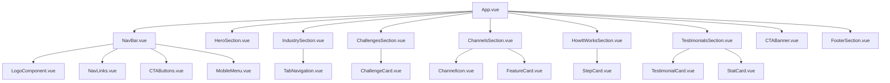
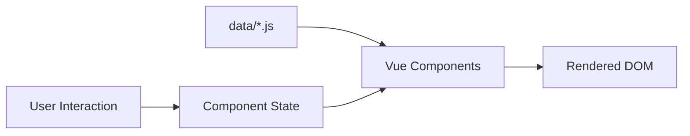

# Dokumen Desain: Omnichannel Landing Page

## Overview

Dokumen ini menjelaskan desain teknis untuk landing page platform omnichannel messaging yang dibangun menggunakan **Vue 3 (Composition API)** dan **Tailwind CSS**. Landing page terdiri dari 9 section utama yang diimplementasikan sebagai komponen Vue terpisah, disusun dalam arsitektur modular untuk kemudahan maintenance dan reusability.

### Keputusan Desain Utama

1. **Single Page Application (SPA) sederhana** — Landing page tidak memerlukan routing karena hanya satu halaman
2. **Komponen modular** — Setiap section adalah Vue component independen
3. **Data-driven content** — Konten statis disimpan dalam file data terpisah untuk kemudahan update
4. **Tailwind CSS utility-first** — Semua styling menggunakan utility classes tanpa custom CSS kecuali untuk animasi khusus
5. **Mobile-first responsive** — Desain dimulai dari mobile, lalu ditingkatkan untuk tablet dan desktop

---

## Architecture

### Arsitektur Komponen



### Struktur Direktori

```
src/
├── App.vue
├── main.js
├── assets/
│   ├── images/
│   │   ├── logo.svg
│   │   ├── hero-illustration.svg
│   │   ├── industry/
│   │   │   ├── ecommerce.svg
│   │   │   ├── hospitality.svg
│   │   │   └── education.svg
│   │   ├── challenges/
│   │   │   ├── new-tool.svg
│   │   │   ├── disorganized.svg
│   │   │   └── limited-conversation.svg
│   │   └── channels/
│   │       ├── whatsapp.svg
│   │       ├── instagram.svg
│   │       ├── tiktok.svg
│   │       ├── telegram.svg
│   │       └── facebook.svg
│   └── styles/
│       └── main.css
├── components/
│   ├── common/
│   │   ├── BaseButton.vue
│   │   ├── SectionHeading.vue
│   │   └── Container.vue
│   ├── NavBar.vue
│   ├── HeroSection.vue
│   ├── IndustrySection.vue
│   ├── ChallengesSection.vue
│   ├── ChannelsSection.vue
│   ├── HowItWorksSection.vue
│   ├── TestimonialsSection.vue
│   ├── CTABanner.vue
│   └── FooterSection.vue
├── composables/
│   └── useMediaQuery.js
└── data/
    ├── navigation.js
    ├── industries.js
    ├── challenges.js
    ├── channels.js
    ├── steps.js
    ├── testimonials.js
    └── footer.js
```

### Alur Data



Alur data bersifat **unidirectional** dan sederhana:
- Data statis di-import dari file `data/`
- State lokal (tab aktif, menu terbuka) dikelola di masing-masing komponen menggunakan `ref()`
- Tidak diperlukan state management global (Pinia/Vuex) karena tidak ada shared state antar section

---

## Components and Interfaces

### Komponen Umum (Common)

#### BaseButton.vue

```vue
<script setup>
defineProps({
  variant: {
    type: String,
    default: 'primary', // 'primary' | 'secondary' | 'outline'
    validator: (v) => ['primary', 'secondary', 'outline'].includes(v)
  },
  size: {
    type: String,
    default: 'md', // 'sm' | 'md' | 'lg'
    validator: (v) => ['sm', 'md', 'lg'].includes(v)
  },
  href: {
    type: String,
    default: null
  }
})
</script>
```

#### SectionHeading.vue

```vue
<script setup>
defineProps({
  title: { type: String, required: true },
  subtitle: { type: String, default: '' },
  align: { type: String, default: 'center' }, // 'left' | 'center'
  dark: { type: Boolean, default: false }
})
</script>
```

#### Container.vue

```vue
<script setup>
defineProps({
  as: { type: String, default: 'div' },
  padding: { type: Boolean, default: true }
})
</script>
<!-- Wrapper dengan max-w-7xl mx-auto px-4 sm:px-6 lg:px-8 -->
```

### Komponen Section

#### NavBar.vue

| Prop | Type | Default | Deskripsi |
|------|------|---------|-----------|
| - | - | - | Tidak menerima props, menggunakan data internal |

| State | Type | Deskripsi |
|-------|------|-----------|
| `isMobileMenuOpen` | `ref<boolean>` | Status buka/tutup mobile menu |

| Event | Deskripsi |
|-------|-----------|
| - | Tidak emit event ke parent |

#### IndustrySection.vue

| State | Type | Deskripsi |
|-------|------|-----------|
| `activeTab` | `ref<string>` | ID tab yang sedang aktif |

| Behavior |
|----------|
| Default tab: `'ecommerce'` saat mount |
| Klik tab mengubah `activeTab` dan menampilkan konten sesuai |

#### ChallengesSection.vue

| Prop | Type | Default | Deskripsi |
|------|------|---------|-----------|
| - | - | - | Data di-import dari `data/challenges.js` |

| Behavior |
|----------|
| Layout alternating berdasarkan index (ganjil/genap) |
| Responsive: vertikal pada mobile |

### Composables

#### useMediaQuery.js

```javascript
import { ref, onMounted, onUnmounted } from 'vue'

export function useMediaQuery(query) {
  const matches = ref(false)

  // Mengembalikan reactive boolean yang mengikuti media query
  return matches
}
```

Digunakan untuk logika responsive yang memerlukan JavaScript (bukan hanya CSS breakpoints).

---

## Data Models

### Navigation Data

```javascript
// data/navigation.js
export const navLinks = [
  { id: 'products', label: 'Products', href: '#products' },
  { id: 'pricing', label: 'Pricing', href: '#pricing' },
  { id: 'resources', label: 'Resources', href: '#resources' }
]

export const ctaButtons = [
  { id: 'demo', label: 'Book a Demo', variant: 'secondary', href: '#demo' },
  { id: 'signup', label: 'Sign Up', variant: 'primary', href: '#signup' }
]
```

### Industries Data

```javascript
// data/industries.js
export const industries = [
  {
    id: 'ecommerce',
    label: 'E-Commerce & Retail',
    image: '/images/industry/ecommerce.svg',
    description: '...'
  },
  {
    id: 'hospitality',
    label: 'Hospitality & Travel',
    image: '/images/industry/hospitality.svg',
    description: '...'
  },
  {
    id: 'education',
    label: 'Education & Training',
    image: '/images/industry/education.svg',
    description: '...'
  }
]
```

### Challenges Data

```javascript
// data/challenges.js
export const challenges = [
  {
    id: 'new-tool',
    title: 'Looking for a new tool',
    description: '...',
    image: '/images/challenges/new-tool.svg'
  },
  {
    id: 'disorganized',
    title: 'Disorganized workflow',
    description: '...',
    image: '/images/challenges/disorganized.svg'
  },
  {
    id: 'limited-conversation',
    title: 'Limited Conversation',
    description: '...',
    image: '/images/challenges/limited-conversation.svg'
  }
]
```

### Channels Data

```javascript
// data/channels.js
export const channels = [
  { id: 'whatsapp', name: 'WhatsApp', icon: '/images/channels/whatsapp.svg' },
  { id: 'instagram', name: 'Instagram', icon: '/images/channels/instagram.svg' },
  { id: 'tiktok', name: 'TikTok', icon: '/images/channels/tiktok.svg' },
  { id: 'telegram', name: 'Telegram', icon: '/images/channels/telegram.svg' },
  { id: 'facebook', name: 'Facebook', icon: '/images/channels/facebook.svg' },
  { id: 'line', name: 'LINE', icon: '/images/channels/line.svg' }
]

export const features = [
  {
    id: 'unified-inbox',
    title: 'Unified Inbox',
    description: '...',
    icon: 'inbox'
  },
  // ... fitur lainnya
]
```

### Steps Data

```javascript
// data/steps.js
export const steps = [
  {
    number: 1,
    title: 'Connect your channels',
    description: '...'
  },
  {
    number: 2,
    title: 'Set up your team',
    description: '...'
  },
  {
    number: 3,
    title: 'Start conversations',
    description: '...'
  }
]
```

### Testimonials Data

```javascript
// data/testimonials.js
export const testimonials = [
  {
    id: 'testimonial-1',
    quote: '...',
    author: '...',
    company: '...',
    avatar: '/images/testimonials/avatar-1.jpg'
  }
]

export const stats = [
  { id: 'stat-1', value: '> 56%', label: 'Increase in response rate' },
  { id: 'stat-2', value: '> 88%', label: 'Customer satisfaction' },
  { id: 'stat-3', value: '> 69%', label: 'Faster resolution time' }
]
```

### Footer Data

```javascript
// data/footer.js
export const footerColumns = [
  {
    title: 'Product',
    links: [
      { label: 'Features', href: '#' },
      { label: 'Integrations', href: '#' },
      { label: 'Pricing', href: '#' }
    ]
  },
  {
    title: 'Company',
    links: [
      { label: 'About', href: '#' },
      { label: 'Blog', href: '#' },
      { label: 'Careers', href: '#' }
    ]
  },
  {
    title: 'Support',
    links: [
      { label: 'Help Center', href: '#' },
      { label: 'Contact', href: '#' },
      { label: 'Status', href: '#' }
    ]
  }
]

export const socialLinks = [
  { id: 'twitter', icon: 'twitter', href: '#' },
  { id: 'linkedin', icon: 'linkedin', href: '#' },
  { id: 'instagram', icon: 'instagram', href: '#' }
]
```

### Tailwind Configuration

```javascript
// tailwind.config.js
export default {
  content: ['./index.html', './src/**/*.{vue,js,ts}'],
  theme: {
    extend: {
      colors: {
        primary: {
          50: '#f5f3ff',
          100: '#ede9fe',
          200: '#ddd6fe',
          300: '#c4b5fd',
          400: '#a78bfa',
          500: '#8b5cf6',
          600: '#7c3aed',
          700: '#6d28d9',
          800: '#5b21b6',
          900: '#4c1d95'
        },
        dark: {
          DEFAULT: '#1e1b4b',
          light: '#312e81',
          lighter: '#3730a3'
        }
      },
      fontFamily: {
        sans: ['Inter', 'system-ui', '-apple-system', 'sans-serif']
      },
      maxWidth: {
        container: '1280px'
      }
    }
  },
  plugins: []
}
```

---

## Error Handling

Karena ini adalah landing page statis tanpa interaksi backend, error handling berfokus pada:

### 1. Image Loading Fallback

```vue
<!-- Contoh penanganan gambar gagal load -->

```

- Gunakan placeholder SVG atau background color jika gambar gagal dimuat
- Pastikan `alt` text selalu tersedia untuk accessibility

### 2. Graceful Degradation

| Skenario | Penanganan |
|----------|------------|
| JavaScript disabled | Konten tetap terlihat (SSR-friendly structure) |
| Gambar gagal load | Tampilkan placeholder dengan background color |
| Font gagal load | Fallback ke system font (sudah dikonfigurasi di fontFamily) |
| Animasi tidak didukung | Gunakan `prefers-reduced-motion` media query |

### 3. Responsive Edge Cases

- Teks yang terlalu panjang: gunakan `truncate` atau `line-clamp` pada area terbatas
- Container overflow: gunakan `overflow-hidden` pada parent elements
- Touch target minimum: semua interactive elements minimal 44x44px pada mobile

---

## Testing Strategy

### Mengapa Property-Based Testing Tidak Diterapkan

Feature ini adalah **landing page UI** yang terdiri dari komponen rendering statis dan interaksi sederhana (tab switch, hamburger menu). PBT tidak sesuai karena:

1. **UI rendering** — Komponen menghasilkan HTML/DOM, bukan data transformations
2. **Konten statis** — Tidak ada input space yang bervariasi secara signifikan
3. **Interaksi sederhana** — Toggle state (buka/tutup menu, ganti tab) adalah binary, bukan universal property
4. **Tidak ada algoritma kompleks** — Tidak ada parser, serializer, atau business logic

### Strategi Testing yang Diterapkan

#### 1. Unit Tests (Vitest + Vue Test Utils)

Fokus pada:
- **Component rendering**: Memastikan setiap komponen render dengan benar
- **Props validation**: Memastikan props diterima dan diterapkan dengan benar
- **User interactions**: Klik tab, toggle menu, hover states
- **Conditional rendering**: Responsive behavior, active states

Contoh test cases:
```javascript
// NavBar.test.js
describe('NavBar', () => {
  it('renders logo, nav links, and CTA buttons')
  it('toggles mobile menu on hamburger click')
  it('shows hamburger icon on mobile viewport')
  it('hides nav links on mobile viewport')
})

// IndustrySection.test.js
describe('IndustrySection', () => {
  it('renders all three tabs')
  it('shows ecommerce tab as active by default')
  it('switches content when tab is clicked')
  it('applies active style to selected tab')
})
```

#### 2. Snapshot Tests

- Capture rendered output setiap komponen untuk mendeteksi perubahan visual yang tidak diinginkan
- Berguna untuk memastikan konsistensi styling setelah refactoring

#### 3. Visual Regression Tests (Opsional)

- Menggunakan tools seperti Percy atau Chromatic untuk mendeteksi perubahan visual
- Capture screenshots pada breakpoints: mobile (375px), tablet (768px), desktop (1280px)

#### 4. Accessibility Tests

- Menggunakan `@vue/test-utils` + `axe-core` untuk automated a11y checks
- Memastikan:
  - Semua gambar memiliki alt text
  - Kontras warna memenuhi WCAG AA
  - Keyboard navigation berfungsi
  - ARIA labels pada interactive elements

#### 5. Manual Testing Checklist

- [ ] Responsive layout pada 3 breakpoints
- [ ] Smooth transitions dan animasi
- [ ] Cross-browser compatibility (Chrome, Firefox, Safari, Edge)
- [ ] Performance (Lighthouse score > 90)
- [ ] Semua link dan button clickable dengan tap target yang cukup

### Test Configuration

```javascript
// vitest.config.js
import { defineConfig } from 'vitest/config'
import vue from '@vitejs/plugin-vue'

export default defineConfig({
  plugins: [vue()],
  test: {
    environment: 'jsdom',
    globals: true,
    setupFiles: ['./tests/setup.js']
  }
})
```

### Coverage Target

- **Komponen**: 80% line coverage minimum
- **Interaksi**: 100% coverage untuk semua user interactions (tab switch, menu toggle)
- **Responsive**: Test pada setiap breakpoint untuk komponen yang berubah layout
