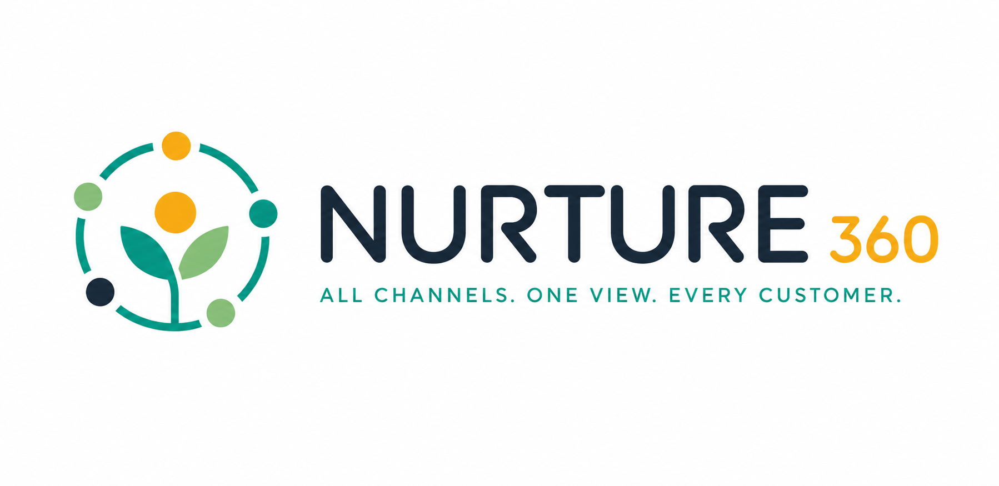
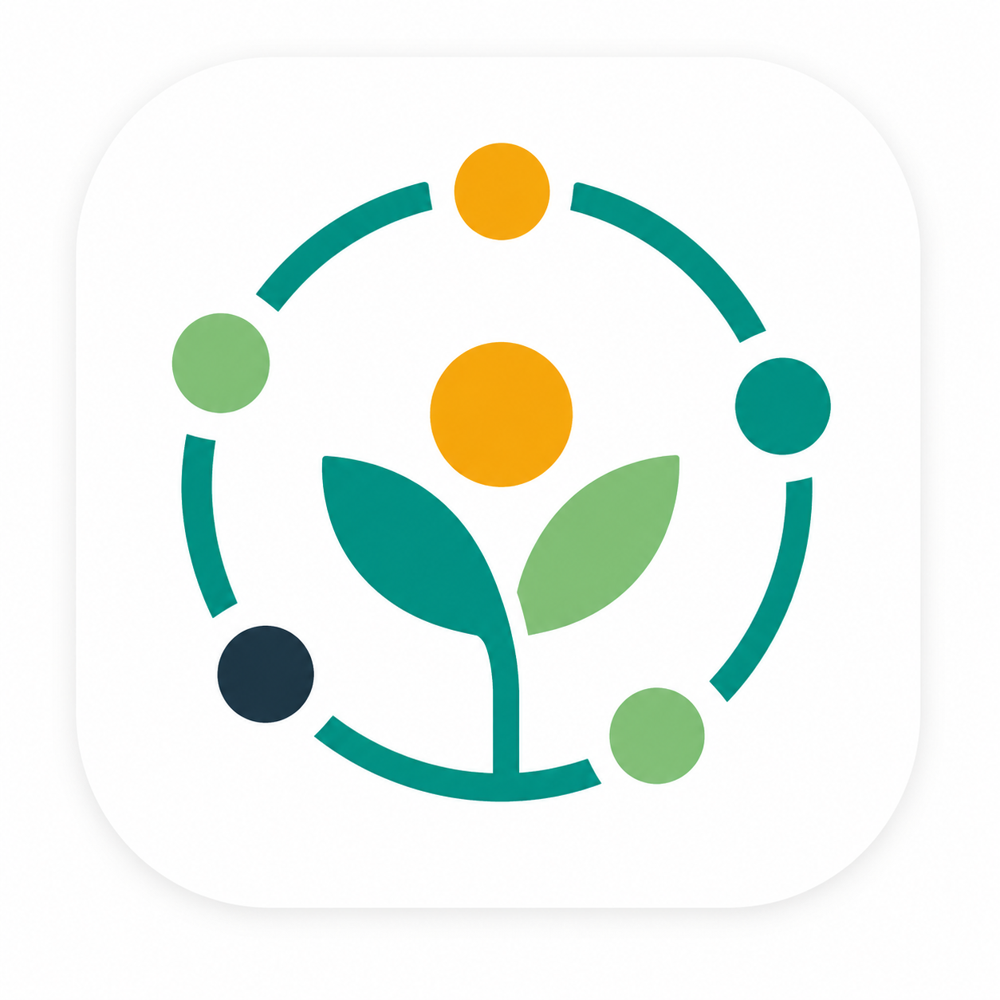

<p align="center">
  <a href="README.md">🇬🇧 Read in English</a>
</p>

<p align="center">
  
</p>

<p align="center">
  
</p>

---

**Nurture360** adalah platform omnichannel messaging yang menyatukan WhatsApp, Instagram, TikTok, Telegram, Facebook, dan LINE ke dalam satu dasbor yang powerful. Berikan pengalaman pelanggan yang mulus dan personal dalam skala besar — dari satu tempat.

## Fitur

| Fitur | Deskripsi |
|-------|-----------|
| **Unified Inbox** | Kelola semua percakapan dari setiap kanal dalam satu tempat, sehingga tim Anda tidak pernah melewatkan pesan. |
| **Smart Routing** | Otomatis tugaskan percakapan ke anggota tim yang tepat berdasarkan keahlian, ketersediaan, dan beban kerja. |
| **Dasbor Analytics** | Pantau waktu respons, skor kepuasan, dan performa tim dengan insight real-time. |
| **Automation** | Atur auto-reply, chatbot, dan pemicu workflow untuk menangani tugas berulang dengan mudah. |

## Kanal yang Didukung

WhatsApp · Instagram · TikTok · Telegram · Facebook · LINE

## Cara Kerja

1. **Hubungkan kanal Anda** — Sambungkan semua platform messaging Anda hanya dalam beberapa klik.
2. **Atur tim Anda** — Undang anggota, tetapkan peran, dan konfigurasi smart routing.
3. **Mulai percakapan** — Layani pelanggan dari satu inbox terpadu.

## Tech Stack

| Lapisan | Teknologi |
|---------|-----------|
| Framework | Vue 3 (Composition API) |
| Build | Vite |
| Styling | Tailwind CSS |
| Testing | Vitest + Vue Test Utils |
| Package Manager | pnpm |

## Memulai

```bash
pnpm install
pnpm dev
```

Build untuk production:

```bash
pnpm build
pnpm preview
```

Jalankan test:

```bash
pnpm test
```

## Struktur Project

```
src/
├── assets/styles/    # Global styles
├── common/           # Komponen UI bersama (Container, BaseButton)
├── components/       # Bagian halaman (Hero, NavBar, Footer, dll.)
├── composables/      # Vue composables (useMediaQuery)
└── data/             # Data konten (channels, steps, testimonials)
```
