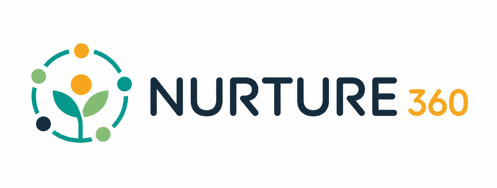

<p align="center">
  <a href="README.id.md">🇮🇩 Baca dalam Bahasa Indonesia</a>
</p>

<p align="center">
  
</p>

<p align="center">
  
</p>

---

**Nurture360** is an omnichannel messaging platform that unifies WhatsApp, Instagram, TikTok, Telegram, Facebook, and LINE into a single powerful dashboard. Deliver seamless, personalized customer experiences at scale — from one place.

## Features

| Feature | Description |
|---------|-------------|
| **Unified Inbox** | Manage all conversations from every channel in one place, so your team never misses a message. |
| **Smart Routing** | Automatically assign conversations to the right team member based on skills, availability, and workload. |
| **Analytics Dashboard** | Track response times, satisfaction scores, and team performance with real-time insights. |
| **Automation** | Set up auto-replies, chatbots, and workflow triggers to handle repetitive tasks effortlessly. |

## Supported Channels

WhatsApp · Instagram · TikTok · Telegram · Facebook · LINE

## How It Works

1. **Connect your channels** — Link all your messaging platforms in just a few clicks.
2. **Set up your team** — Invite members, assign roles, and configure smart routing.
3. **Start conversations** — Engage with customers from a single unified inbox.

## Tech Stack

| Layer | Technology |
|-------|------------|
| Framework | Vue 3 (Composition API) |
| Build | Vite |
| Styling | Tailwind CSS |
| Testing | Vitest + Vue Test Utils |
| Package Manager | pnpm |

## Getting Started

```bash
pnpm install
pnpm dev
```

Build for production:

```bash
pnpm build
pnpm preview
```

Run tests:

```bash
pnpm test
```

## Project Structure

```
src/
├── assets/styles/    # Global styles
├── common/           # Shared UI components (Container, BaseButton)
├── components/       # Page sections (Hero, NavBar, Footer, etc.)
├── composables/      # Vue composables (useMediaQuery)
└── data/             # Content data (channels, steps, testimonials)
```
